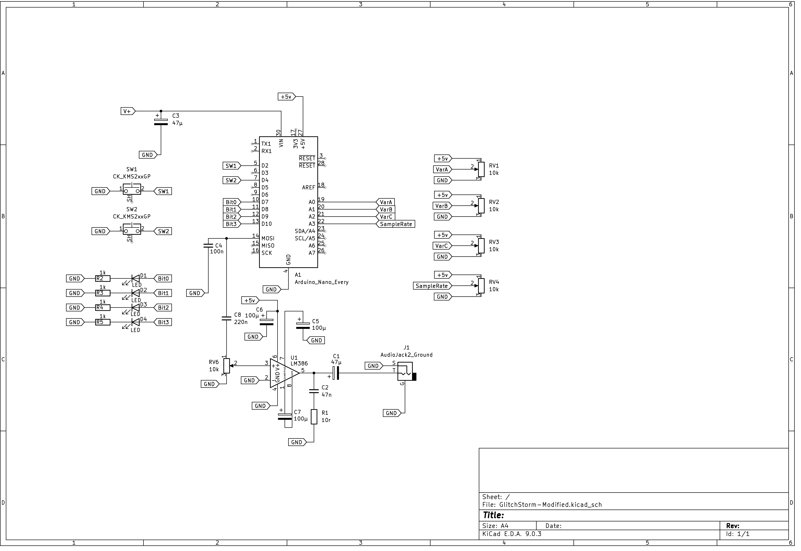
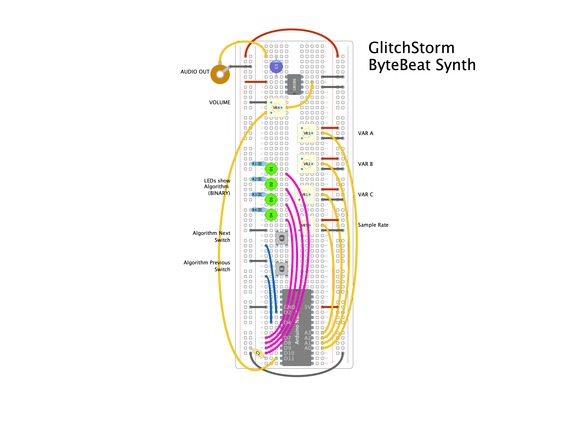

# Glitch-Storm

This is my take on [Glitch-Storm](https://github.com/spherical-sound-society/glitch-storm) by [Sphereical Sound Society](https://github.com/spherical-sound-society). This is my fork of that project. 

I made the following changes: 

- Added a an LM386 as an output buffer (see the updated schematic)
- Added an extra pot to control the sample rate
- Updated and refactored codebase (see notes and comments)
- Added detailed comments
- Removed easter egg mode 

I presented this project at Noisebridge, see this blog post: http://www.super-freq.com/glitchstorm-at-noisebridge/

**Updated schematic:** 



**Breadboard Layout:**



[Print friendly pdf](Glitchstorm Print.pdf)

## 🎵 What Are Bytebeats?

**Bytebeats** are tiny computer programs that generate sound — often surprisingly musical — using just a **single line of math**.

Instead of using samples or instruments, bytebeats generate raw audio by computing a new number (a byte: `0–255`) for every tiny time step. These numbers are sent straight to the audio output.

### 💡 The Basic Formula

```c
output = t * (t >> 5 | t >> 8);
```

* `t` is the time counter (it just goes up every step).
* The result is sent directly to a speaker or audio buffer.
* The math makes patterns — rhythms, tones, even melodies.

## 🧬 Where Did Bytebeats Come From?

Bytebeats were first popularized in **2011** by a Finnish programmer named **viznut**, who posted videos and articles showing how you could make surprisingly cool music with just **a few characters of code**.

He showed how you could use nothing more than:

```c
for (t = 0;; t++) putchar(t * (42 & t >> 10));
```

...and it would create a full-on chiptune jam — complete with rhythm and melody — **from just that**.

### 📼 Why Bytebeats are Cool

* **Ultra-minimalism**: Music from a single line of code!
* **Retro vibes**: Sounds like early game consoles and synths.
* **Hackable**: Just tweak some math and hear something totally new.
* **Fun + Unexpected**: Equations create strange, beautiful sounds.

### 🧪 What Makes Bytebeats Interesting?

* Bitwise operations like `>>`, `|`, `&`, and `^` shape waveforms in strange and unique ways.
* Patterns emerge from the structure of binary math — **music from math**!
* Despite their simplicity, they often produce **melodies, rhythms, and harmonies**.

### 🔧 Glitch Storm Bytebeats

In Glitch Storm:

* Each equation is a **bytebeat**.
* Parameters `a`, `b`, `c` (controlled by knobs) modify the math in real-time.
* The Arduino generates audio by running these equations inside a fast timer interrupt.

## 🧠 Bytebeat Trivia

* Bytebeats are not just art — they’re a **math experiment**, a **programming puzzle**, and **music** all in one.
* Some equations resemble **fractal patterns** or **cellular automata**.
* You can explore an infinite sound universe by changing just one symbol.

### 🛠 Want to Try Your Own?

Start with:

```c
return t * ((t >> 8) & (t >> 5));
```

...then add parentheses, `^`, `|`, `*`, or constants and hear what happens!

## 🔊 LM386 Amplifier – Audio Output for Glitch Storm

Glitch Storm generates audio using the Arduino Nano’s PWM (Pulse Width Modulation) signal. While this creates cool digital sound, it's **too weak to drive a speaker directly** — we need an amplifier.

### 💡 LM386

The **LM386** is a tiny, low-voltage audio amplifier chip that’s perfect for simple sound projects. In this setup, it boosts the audio signal enough to drive a small speaker or headphones.

The project as presented powers the LM386 with 5v from the Nano. The LM386 can run from 4v to 12v, using a higher voltage will provide more output.

### ⚙️ How It's Wired

* **Input (Pin 3)** of the LM386 connects to the Nano’s **PWM output pin** (Pin 11).
* **Output (Pin 5)** goes to your **speaker**.
* **Power (Pin 6)** is connected to the **5V output** from the Nano.
* **Ground (Pin 4)** goes to **GND**.
* **Bypass and gain pins** (Pins 1, 8, 7) are left in default mode for simplicity.

You're using the **simplest mode** of the LM386 — no gain resistor or capacitor added — which sets the **gain to 20**.

### 📈 What Gain Means

"Gain" just means **how much louder** the amplifier makes the signal.

* Gain of 1: No amplification
* Gain of 20: The LM386's default, boosts the output x 20
* You can go up to x 200 by adding a capacitor between Pins 1 and 8 — not used here.

I've added a pot between the Nano's ouput and the input of the LM386 to act as a volume control. This allows you to control the input to control the output gain from 0 to 20. 

### 🧪 Tips for Builders

* Use an **8Ω speaker** or headphones.
* Add a small capacitor (e.g. **100nF**) between **Vcc and GND** close to the LM386 to reduce noise.
* The LM386 will not give super loud output — but it’s **perfect for glitchy digital sounds**!

### 🔌 Power Note

The amplifier is powered from the **Nano’s 5V output**, so no extra batteries are needed. This keeps the project simple and compact.

### ✅ Summary

| Part        | Description                 |
| ----------- | --------------------------- |
| **LM386**   | Boosts PWM signal from Nano |
| **Gain**    | 20 (default, simple wiring) |
| **Speaker** | Driven from LM386 output    |
| **Power**   | Shared 5V supply from Nano  |

### 🧠 **Overview: What is Glitch Storm?**

**Glitch Storm** is a minimalist audio synthesizer that uses *Bytebeat-style* math equations to generate interesting, glitchy sound patterns. These equations are evaluated rapidly in an **interrupt** and the results are sent to a speaker via **PWM (Pulse Width Modulation)** — no DAC or audio chip needed!

For more detail, see the comments in the source code.

## 🧱 Code Breakdown by Section

### 🔌 **Includes and Definitions**

```cpp
#include <stdint.h>
#include <avr/interrupt.h>
#include <avr/io.h>
#include <avr/pgmspace.h>

#include "equations.h"
```

**Explanation:**

* These are **low-level AVR libraries** used for direct access to the microcontroller’s hardware.
* `equations.h` is a custom header that stores all the sound-generating functions and their parameter ranges.

### 🧷 **Pin and Debug Configurations**

```cpp
#define isDebugging   false
#define ledPin        13
#define speakerPin    11
#define upButtonPin   2
#define downButtonPin 4
#define progBit0Pin   7
#define progBit1Pin   8
#define progBit2Pin   9
#define progBit3Pin   10
```

**Explanation:**

* These define **pin numbers** used for input and output.
* The `progBitXPin` pins are used to light up LEDs in **binary**, showing the current selected program.

### 📊 **Global Variables**

```cpp
long t = 0;
volatile uint8_t a = 0, b = 0, c = 0;
volatile int value;
byte programNumber = 0;
byte clocksOut = 0;
bool isClockOutMode = false;
static unsigned long time_now = 0;
int SAMPLE_RATE = 16384;
const uint8_t NUM_EQUATIONS = sizeof(equations) / sizeof(equations[0]);
```

**Explanation:**

* `t` is a **time counter**, passed into the Bytebeat equations.
* `a`, `b`, `c` are variables controlled by the **knobs (pots)**.
* `programNumber` tracks the current sound equation.
* `SAMPLE_RATE` controls the frequency of equation updates.
* `NUM_EQUATIONS` is calculated automatically from `equations[]`.

### 🔊 **initSound() — Setup Audio Output with Timers**

```cpp
void initSound() {
  pinMode(speakerPin, OUTPUT);

  // Setup Timer2 for PWM on Pin 11
  TCCR2A |= _BV(WGM21) | _BV(WGM20);
  TCCR2B &= ~_BV(WGM22);
  TCCR2A = (TCCR2A | _BV(COM2A1)) & ~_BV(COM2A0);
  TCCR2B = (TCCR2B & ~(_BV(CS12) | _BV(CS11))) | _BV(CS10);
  OCR2A = 0;

  // Setup Timer1 to trigger interrupts at sample rate
  cli(); // disable interrupts
  TCCR1B = (TCCR1B & ~_BV(WGM13)) | _BV(WGM12);
  TCCR1A = TCCR1A & ~(_BV(WGM11) | _BV(WGM10));
  TCCR1B = (TCCR1B & ~(_BV(CS12) | _BV(CS11))) | _BV(CS10);
  OCR1A = F_CPU / SAMPLE_RATE;
  TIMSK1 |= _BV(OCIE1A);
  sei(); // enable interrupts
}
```

**Explanation:**

* **Timer2** generates PWM audio by changing the duty cycle on pin 11.
* **Timer1** generates an **interrupt** at the audio sample rate.
  * Inside the interrupt, we evaluate the current equation and update the audio PWM value.

Read more about timers PWM here: https://docs.arduino.cc/tutorials/generic/secrets-of-arduino-pwm/

### 🎛 **buttonsManager() — Handle Button Presses**

```cpp
void buttonsManager() {
  static bool upButtonLastState = HIGH;
  static bool downButtonLastState = HIGH;

  bool upButtonState = digitalRead(upButtonPin);
  bool downButtonState = digitalRead(downButtonPin);

  if (upButtonLastState == LOW && upButtonState == HIGH) {
    programNumber++;
    if (programNumber >= NUM_EQUATIONS) programNumber = 0;
    ledCounter();
  }

  if (downButtonLastState == LOW && downButtonState == HIGH) {
    if (programNumber > 0) {
      programNumber--;
    } else {
      programNumber = NUM_EQUATIONS - 1;
    }
    ledCounter();
  }

  upButtonLastState = upButtonState;
  downButtonLastState = downButtonState;
}
```

**Explanation:**

* Detects **rising edge** (button release) to switch programs.
* Wraps around when reaching the first or last program.
* Calls `ledCounter()` to update LEDs.

### 🚀 **setup() — Arduino Startup Function**

```cpp
void setup() {
  pinMode(ledPin, OUTPUT);
  pinMode(progBit0Pin, OUTPUT);
  pinMode(progBit1Pin, OUTPUT);
  pinMode(progBit2Pin, OUTPUT);
  pinMode(progBit3Pin, OUTPUT);

  pinMode(upButtonPin, INPUT_PULLUP);
  pinMode(downButtonPin, INPUT_PULLUP);

  initSound();
  ledCounter();

  if (isDebugging) {
    Serial.begin(9600);
  }
}
```

**Explanation:**

* Sets up all pins and starts audio.
* Uses `INPUT_PULLUP` so buttons can be wired to ground.
* Optionally enables serial debugging.

### 🔁 **loop() — Arduino Main Loop**

```cpp
void loop() {
  buttonsManager();
  potsManager();

  if (isDebugging) {
    if (millis() > time_now + 1000) {
      time_now = millis();
      printValues();
    }
  }
}
```

**Explanation:**

* Regularly checks buttons and knobs.
* Prints variable values once per second if debugging is enabled.

### 🎚 **potsManager() — Reads Potentiometer Values**

```cpp
void potsManager() {
  int analogA = analogRead(A0);
  int analogB = analogRead(A1);
  int analogC = analogRead(A2);

  a = scaleParam(analogA, equations[programNumber].aMin, equations[programNumber].aMax);
  b = scaleParam(analogB, equations[programNumber].bMin, equations[programNumber].bMax);
  c = scaleParam(analogC, equations[programNumber].cMin, equations[programNumber].cMax);

  SAMPLE_RATE = map(analogRead(3), 0, 1023, 256, 32768);
  OCR1A = F_CPU / SAMPLE_RATE;
}
```

**Explanation:**

* Reads analog pots (A0, A1, A2) and maps them to ranges defined per equation.
* A fourth pot controls the **sample rate**, changing the pitch/tone of all sounds.

### 💡 **scaleParam() — Utility Mapping Function**

```cpp
uint8_t scaleParam(int analogValue, uint8_t minVal, uint8_t maxVal) {
  return map(analogValue, 0, 1023, minVal, maxVal);
}
```

**Explanation:**

* Maps analog input range (0–1023) to desired parameter range.

### 💡 **ledCounter() — Binary LED Display of Program**

```cpp
void ledCounter() {
  digitalWrite(progBit0Pin, bitRead(val, 0));
  digitalWrite(progBit1Pin, bitRead(val, 1));
  digitalWrite(progBit2Pin, bitRead(val, 2));
  digitalWrite(progBit3Pin, bitRead(val, 3));
}
```

**Explanation:**

* Displays `programNumber` in binary using 4 LEDs.

### 🛠 **printValues() — Debug Info**

```cpp
void printValues() {
  Serial.print("program: ");
  Serial.print(programNumber);
  Serial.print("  a: ");
  Serial.print(a);
  Serial.print("  b: ");
  Serial.print(b);
  Serial.print("  c: ");
  Serial.println(c);
}
```

**Explanation:**

* Prints the current state to the Serial Monitor (if `isDebugging` is true).

**Note!** Do to the use of Timers and Interrupts, code here is not run on the regular schedule. Therefore printing serial ouput will be inconsistent or nonexistent. **If you are debugging with serial output turning the sample rate down will allow serial messages to display!**

### ⏱ **ISR — Audio Interrupt: Runs at Sample Rate**

```cpp
ISR(TIMER1_COMPA_vect) {
  if (programNumber >= NUM_EQUATIONS) programNumber = 0;
  value = equations[programNumber].func(t, a, b, c);
  OCR2A = value;
  t++;
}
```

**Explanation:**

* **Runs very frequently** (16kHz+).
* Evaluates the current equation, sends output to the speaker via PWM.
* This is what **generates the sound**!

## ✅ What You Can Modify

| Area          | What they can try                     |
| ------------- | ------------------------------------- |
| `equations.h` | Add or change equations               |
| LED logic     | Use LED animations or other displays  |
| Button system | Add mode switchers, tap tempo, etc.   |
| Pot ranges    | Add more expressive parameter scaling |
| Sample rate   | Explore effects of fast/slow sampling |
| Audio output  | Use `analogWrite()` on other boards   |

## 📄 `equations.h` — Where the Sounds come from

The `equations.h` file is the **heart of Glitch Storm's sound engine**. It contains all the math-based **Bytebeat equations** used to generate glitchy, rhythmic, or melodic audio. Each equation is a small function that outputs a sound sample based on:

* Time (`t`)
* Parameters (`a`, `b`, `c`) — controlled by the 3 knobs

### 🧱 File Structure

The file has **three main parts**:

1. **Function declarations** for each equation
2. **A metadata struct** for parameter scaling
3. **An array** linking metadata + equations together

### 1. ⚙️ Equation Functions

```cpp
uint8_t equation_0(uint32_t t, uint8_t a, uint8_t b, uint8_t c) {
  return (t >> 5 | t >> a) * b;
}
```

Each equation is:

* A function named `equation_X` (where `X` is a number)
* It returns an 8-bit audio value (`0–255`)
* It takes in:

  * `t` (time, constantly increasing)
  * `a`, `b`, `c` (parameters from the knobs)

#### 🧪 Try This

Want to write your own equation? Copy an existing one and tweak the math. Try:

```cpp
return (t * (t >> a | t >> b)) & c;
```

### 2. 🗃️ Metadata for Each Equation

```cpp
struct EquationMeta {
  EquationFunc func;
  uint8_t aMin, aMax;
  uint8_t bMin, bMax;
  uint8_t cMin, cMax;
};
```

**Why this exists:**
Each knob-controlled parameter (`a`, `b`, `c`) needs a sensible range. Some equations sound good when `a` is 0–10, others from 0–255.

This `struct` allows each equation to define the range of its parameters.

### 3. 🎛️ equations\[] Array

```cpp
const EquationMeta equations[] = {
  { equation_0, 0, 10, 0, 255, 0, 255 },
  { equation_1, 0, 10, 0, 14, 0, 14 },
  ...
};
```

Each row contains:

* The function to run
* The min/max for `a`
* The min/max for `b`
* The min/max for `c`

🔧 These ranges are used in `potsManager()` to scale the knob values properly:

```cpp
a = scaleParam(analogA, equations[programNumber].aMin, equations[programNumber].aMax);
```

## 🧠 Bytebeat Equation Tips

* `>>` = Bit shift right (divides by power of 2)
* `|` = Bitwise OR (merges patterns)
* `&` = Bitwise AND (filters patterns)
* `*`, `+`, `-` = Standard math
* Tiny changes make **big** sound differences!

## ✅ What You Can Do

| What to Try             | How                               |
| ----------------------- | --------------------------------- |
| Add a new equation      | Copy an existing one and tweak it |
| Change parameter ranges | Adjust values in `equations[]`    |
| Rename equations        | Keep the `equation_X` format      |
| Disable/skip equations  | Comment them out in the array     |
| Make noise!             | Deliberately break things 😄      |

## 🧰 Want a Starter Template?

Here’s a blank equation template:

```cpp
// Define a new equation
uint8_t equation_99(uint32_t t, uint8_t a, uint8_t b, uint8_t c) {
  return (t >> a) * b + (t & c);
}

// Add this to the array and set min and max for a, b, and c parameters:
{ equation_99, 0, 10, 0, 255, 0, 255 },
```

## Conclusion! 

See the source code for more comments describing the inner workings of this project! 

Happy glitching! ⚡🎧

